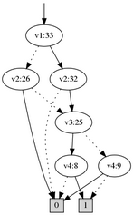

JDD
===

JDD is a decision diagram library written in pure Java. It supports
`Binary Decision Diagrams <https://en.wikipedia.org/wiki/Binary_decision_diagram>`_ (BDD) and
`Zero-suppressed Decision Diagram <https://en.wikipedia.org/wiki/Zero-suppressed_decision_diagram>`_ (Z-BDD or just ZDD).

Binary Decision Diagrams (BDDs) are used in formal verification, CSP, optimisation and more.
To work with BDDs, you need a BDD library. JDD is a Java implementation of a decision
diagram library inspired by BuDDy (a BDD package written in C).
It also includes support for Zero-suppressed BDDs.

Using JDD
---------

A good place to start is the `tutorial <docs/Tutorial.rst>`_.

The source code contains a number of examples under src/jdd/examples:

* BDDQueens, ZDDQueens and ZDDCSPQueens: the N-Queens problem solved with BDDs, Z-BDDs and Z-BDD CSP operators
* Solitaire: The solitaire example from the BuDDy distribution
* Adder: Yet another example stolen from the BuDDy distribution
* Milner: Milner's scheduler, from BuDDy...

If you encounter any problems, make sure to check out the `Frequently Asked Questions <docs/FAQ.rst>`_.

Getting JDD
-----------

Get the code and compile it yourself::

    git clone https://bitbucket.org/vahidi/jdd.git

... or import it in Gradle::

    dependencies {
        compile 'org.bitbucket.vahidi.jdd:114'
    }

... or maven::

    <dependency>
        <groupId>org.bitbucket.vahidi</groupId>
        <artifactId>JDD</artifactId>
        <version>114</version>
    </dependency>

Building JDD
------------

We use Apache Maven to build JDD::

    git clone https://bitbucket.org/vahidi/jdd.git

    cd jdd
    mvn package

    ls target/

License
-------

JDD is free software under the zlib license. You may use it free of charge in research or even commercial projects.

For academic publications, feel free to use a BibTeX entry similar to this for citation::

    @MISC{jdd,
        author = {Arash Vahidi},
        title = {JDD: a pure Java BDD and Z-BDD library},
        howpublished = "\url{https://bitbucket.org/vahidi/jdd}",
        year = "2003"
    }
